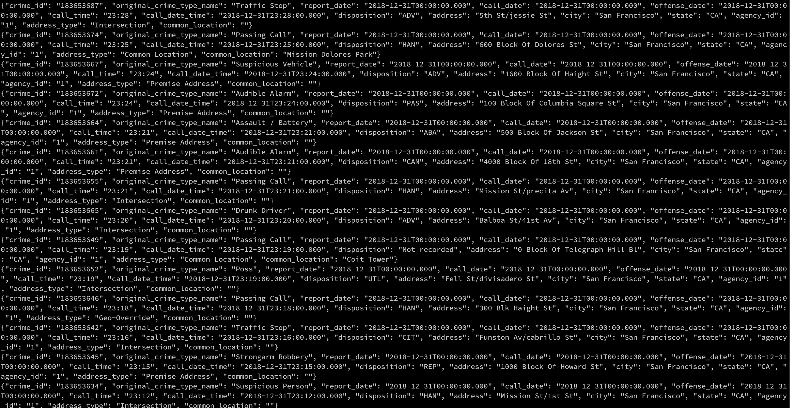
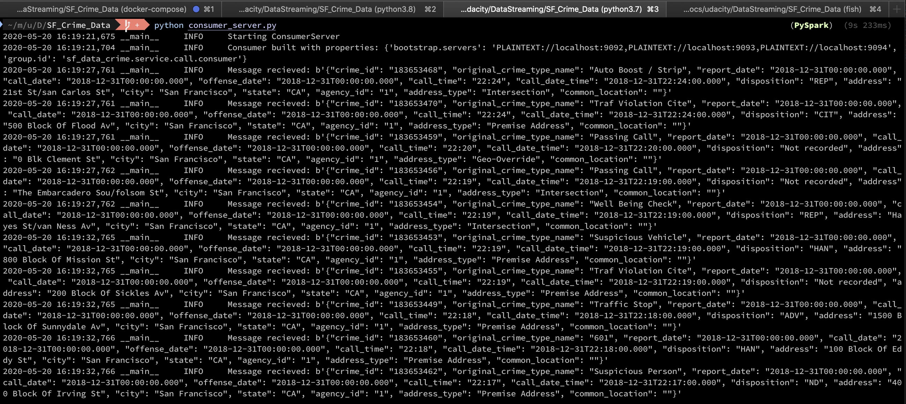
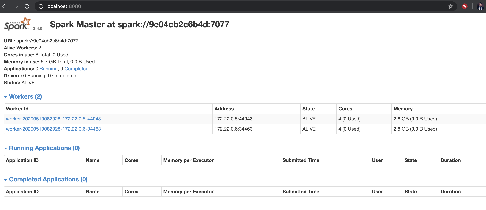
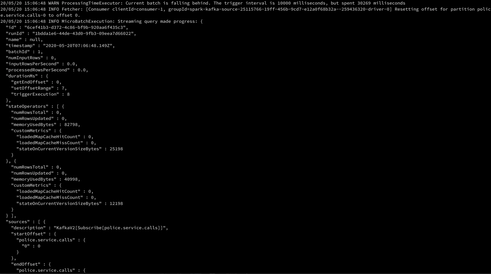

# SF Crime Statistics with Spark Streaming Project

## Introduction 

This projects process data from Kafka in Spark, using PySpark.
I reused the docker compose approach of the previous project, removed the unnecessary pods and added 
a Stand alone Spark cluster with one master and two executors.

## Requirements

* Docker Compose
* Java 1.8.x / Scala 2.11.x / Spark 2.4.x : Only for spark-submit
* Kafka
* Python 3.7
* The input json files from Udacity are BYO because GitHub was rejecting the commits including them.

## Installing the local environment

To install the environment using anaconda please execute `conda install --name myenv --file environment.txt`, 
to install the requirements in your own Python 3.7 use the requirements file `pip install -r requirements.txt`

## Start the docker environment

To start Kafka and Spark simply use `docker compose up`

The program should still run with local installations, but changing the broker and the spark master URL might be necessary.

## Execute the program

### 1.2 Run the producer

`python kafka_server.py`

The raw output can be obeserved with:

`docker exec sf_crime_data_kafka0_1 /usr/bin/kafka-console-consumer --bootstrap-server kafka0:9092 --topic "sf_crime_data.police.service.calls" --from-beginning`

Or if you have a local kafka installation with:

`kafka-console-consumer --bootstrap-server localhost:9092 --topic "sf_crime_data.police.service.calls" --from-beginning`

Th output looks like this:

### 1.2 Run the consumer

`python consumer_server.py`

The output looks like this:

### 2. Submit the Spark application

`spark-submit --packages org.apache.spark:spark-sql-kafka-0-10_2.11:2.4.5 --master localhost:8080 data_stream.py`

The Spark UI while executing looks like:

And the console output:

